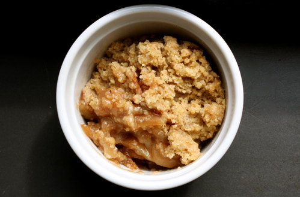
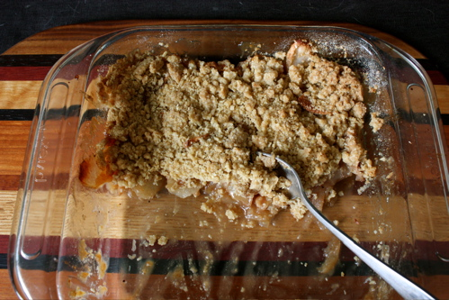

# Apple Crisp

 I've hardly made a dent in my apples. I'm thinking about making some applesauce (but I have to go buy a food mill for that), and I haven't psyched myself up to tackle an apple pie yet, so I thought apple crisp would be a nice and easy way to get the ball rolling.  And it is. To the point where I should've doubled the recipe and made it in a 9" x 12" pan instead of an 8" square one. Which is what I'm doing tomorrow. And what you should do too. And what this recipe makes. A word about topping: some people like their topping to be super crumbly and sugary. Others go the cakey route. This one is somewhere in the middle because I've used a good amount of flour, but I've still kept a healthy amount of butter in there. I also added oatmeal and oat flour to the all-purpose flour, but I imagine you could really use whatever flour you like or do a gluten-free version (barley or quinoa flours would be good).  Because if you're anything like me, you just can't take that giant bowl of apples staring at you from the dining room table. Yes, apples can stare. And glare. And goad. It's true. Quick, get going! And have a loverly weekend all.

### Apple Crisp

_To fit in a 9" x 12" pan_ 10 cups apples (I used a combination of Macintosh and Baldwin, both kind of tart) 1/2 cup brown sugar 3 tablespoons all-purpose flour 2 teaspoons ground cinnamon 1/2 teaspoon nutmeg, freshly ground 2 tablespoons lemon juice _Topping_: 3/4 cup all-purpose flour 1/2 cup oat flour 1/4 cup oatmeal 2/3 cup brown sugar 1 teaspoon sea salt 10 tablespoons butter, chilled and cut into pieces 1/2 cup walnuts or pecans, chopped (optional) Preheat oven to 350ºF/180ºC. Peel and cut apples into slices and put them in a 9" x 12" baking dish. Combine the next five ingredients in a small bowl and pour that over the apples, mixing well and distributing the coated apples in an even layer in the pan. Mix the flours, oatmeal, brown sugar and salt in bowl. Cut the butter into the mixture with a pastry blender until it forms pea size lumps. Stir in nuts if using and sprinkle topping over apples. Bake for 35-45 minutes or until the top is nicely browned and your kitchen smells so good you can't stand it any longer.
