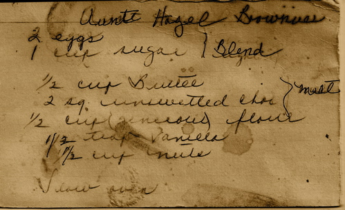
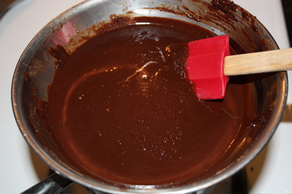
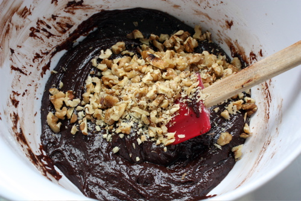
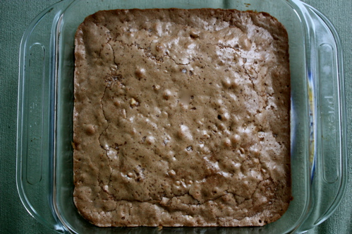
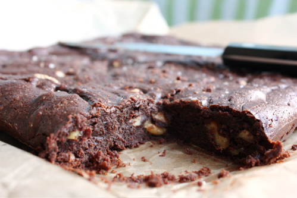

# Aunt Hazel's Brownies

This is a longtime family favorite that came from my mother's (yup, you guessed it), Aunt Hazel. Aunt Hazel was a lean, mean baking machine. The woman had a serious thing for butter. According to family lore, she died of cirrhosis of the liver without having had a drop of alcohol in her life. We've always given my mother a hard time about this claim ("Come on, you know she was swigging from the vanilla extract, Mom!"), but it turns out that it may have been the case after all (nothing like [Wikipedia](http://en.wikipedia.org/wiki/Non-alcoholic_fatty_liver_disease) to make you feel really guilty about teenage finger-pointing).

However she passed into the next realm, she left behind a damn good brownie recipe. It's gooey, and, yes, it is indeed buttery. It has such a small amount of flour as to resemble a flourless chocolate cake in a way, which is a very nice thing to resemble.

However, over the years, I've started thinking it could be just a tad chocolatey-er, so I added another ounce of chocolate to the original recipe. A few times, I've used cake flour (on the suggestion of Erica Bruce's recipe in _Cooks Illustrated_), which actually gives the brownies a nice consistency, but it's not necessary. I've even used cocoa powder\* when I was desperate (desperate for instant brownie gratification, that is), and it worked quite well, although it didn't have the same gooeyness. But one addition that I'm definitely adding to the permanent update is a healthy pinch of Maldon sea salt sprinkled over the top before popping the pan into the oven. I think it adds a nice counterpoint to the sweetness of the brownie.

Whatever minor changes have been made, this is still Aunt Hazel's brownie recipe at its core. And Aunt Hazel, wherever you are, please accept my sincere apologies (and those of my siblings who were complicit in this) for calling you a lush all these years.

* 1/2 cup butter, cut into tablespoons
* 3 ounces unsweetened chocolate, cut into small pieces
* 1 cup sugar
* 1/2 teaspoon vanilla
* 2 eggs
* A generous 1/2 cup flour
* 1/4 teaspoon salt
* 1/2 cup walnuts, chopped Pinch of Maldon sea salt or some other flaky salt (optional)

Preheat oven to 325ºF/163ºC. Line an 8"x 8" inch baking dish with parchment paper, making sure one layer has an overhang of a couple inches (this overhang will become the handles you use to lift the brownies out of the pan). Put the butter and chocolate in a heatproof dish on top of a simmering pan of water. Stir regularly until everything is melted.

Add the sugar and continue to simmer to dissolve the sugar a bit. Take the pan off the heat and let cool until warm. Stir in vanilla. Add eggs one at a time. Add flour and salt and stir until batter is glossy. Stir in the nuts and pour into pan.

 

Sprinkle top with Maldon sea salt. Bake for 20-30 minutes. The brownies are done when a toothpick comes out crumbly (not wet -- underdone and not completely clean -- overdone). Let cool at room temperature (or you can put the pan in the refrigerator or freezer if you're really impatient). 

Lift out by the parchment paper and cut into squares. * 3/4 cup to substitute; also, FYI, the bottom photo is the version made with cocoa (note the smoother top vs. the crackly one made with solid chocolate).

